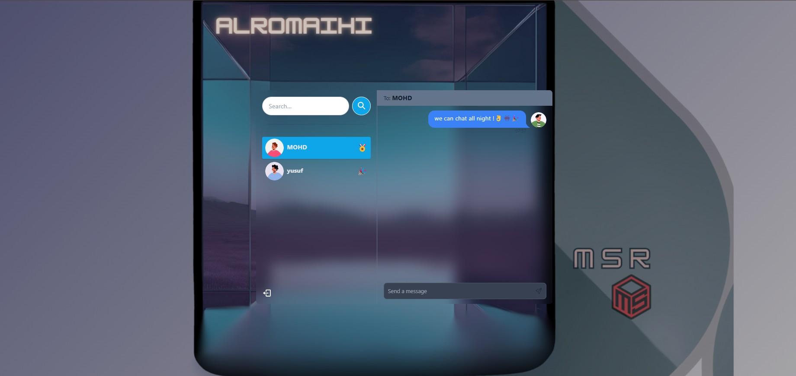

# LIVE CHATAPP Mongo + Express + React + Nodejs (MERN FULL STACK) + Build and Deploy a Real Time Chat App | JWT, Socket.io



## Introduction

Welcome to the Live ChatApp, a real-time chat application built using the MERN stack (MongoDB, Express, React, Node.js). This project demonstrates how to create a full-stack application with real-time communication using Socket.io and secure authentication with JWT.

## Features

- 🔄 **Real-time Messaging**: Communicate instantly with other users.
- 🔒 **User Authentication**: Secure login and signup using JWT.
- 📱 **Responsive Design**: Optimized for both desktop and mobile devices.
- 👤 **User Profiles**: Customizable user profiles with avatars.
- 🟢 **Online Status**: See which users are currently online.
- 🔔 **Message Notifications**: Receive notifications for new messages.

## User Experience

The Live ChatApp provides a seamless and intuitive user experience:

1. **Signup and Login**: Users can create an account or log in using their credentials. Passwords are securely hashed using bcrypt.
2. **User Dashboard**: After logging in, users are greeted with a dashboard displaying their contacts and recent conversations.
3. **Real-time Chat**: Users can select a contact and start chatting in real-time. Messages are instantly delivered and displayed.
4. **Profile Management**: Users can update their profile information and avatar.
5. **Online Status**: Users can see which of their contacts are currently online, enhancing the real-time experience.
6. **Notifications**: Users receive notifications for new messages, ensuring they never miss an important conversation.

## Installation

To get started with the Live ChatApp, follow these steps:

1. **Clone the repository**:

    ```sh
    git clone https://github.com/Msr7799/chat-app-yt.git
    cd chat-app-yt
    ```

2. **Set up environment variables**:

    Create a [.env](http://_vscodecontentref_/1) file in the root directory and add the following:

    ```env
    MONGO_DB_URI=your_mongodb_uri
    JWT_SECRET=your_jwt_secret
    PORT=5000
    NODE_ENV=development
    ```

3. **Build the frontend**:

    ```sh
    npm run build
    ```

    ```sh
    yarn run build
    ```

4. **Run the application**:

    ```sh
    npm start 
    ```

    ```sh
    yarn start
    ```

## Technologies Used

- **MongoDB**: NoSQL database for storing user and message data.
- **Express**: Web framework for building the backend API.
- **React**: Frontend library for building the user interface.
- **Node.js**: JavaScript runtime for the backend server.
- **Socket.io**: Library for real-time communication.
- **JWT**: JSON Web Tokens for secure authentication.
- **bcrypt**: Library for hashing passwords.
- **Tailwind CSS**: Utility-first CSS framework for styling.

## Contributing

We welcome contributions to the Live ChatApp! If you have any ideas, suggestions, or bug reports, please open an issue or submit a pull request.

## License

This project is licensed under the ISC License.

## Author

Mohamed Alromaihi

---

Thank you for using the Live ChatApp! We hope you enjoy the experience. If you have any questions or feedback, feel free to reach out.